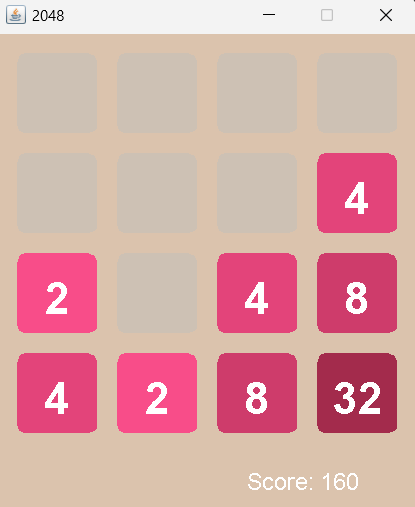

# Game 2048

## Опис проекту

2048 — це класична головоломка, в якій гравці пересувають плитки на ігровому полі розміром 4x4, об'єднуючи їх, щоб досягти числа 2048. Ця версія гри написана мовою програмування Java з використанням бібліотек **Swing** та **AWT** для створення графічного інтерфейсу та обробки подій.

## Функціонал

- **Ігрове поле 4x4**: Ви можете пересувати плитки по полю, об'єднуючи їх, якщо їх значення однакові.
- **Клавіатурне управління**: Використовуйте стрілки для пересування плиток і клавішу `ESC` для скидання гри.
- **Графічний інтерфейс**: Плитки мають індивідуальні кольори та шрифти залежно від їх значення.
- **Механізм гри**:
    - Кожна плитка має своє числове значення.
    - Після кожного переміщення додається нова плитка зі значенням 2 або 4.
    - Якщо не залишилося ходів — гравець програє.

## Використані бібліотеки та фреймворки

- **Java Swing**: Використовується для створення графічного інтерфейсу гри.
- **AWT (Abstract Window Toolkit)**: Використовується для обробки подій клавіатури та малювання компонентів гри.

## Як грати

1. Запустіть гру. Ігрове поле матиме дві початкові плитки зі значеннями 2 або 4.
2. Використовуйте клавіші-стрілки для пересування плиток.
3. Якщо дві плитки з однаковими значеннями стикаються — вони об'єднуються.
4. Мета — досягти плитки зі значенням 2048.
5. Якщо не залишилося можливих ходів — гра закінчена.

## Як запустити проект

1. Завантажте та розпакуйте вихідний код.
2. Запустіть клас `Game2048` у вашому IDE.
3. Насолоджуйтесь грою!

## Скріншоти

## Контакти

Якщо у вас виникли питання або пропозиції, звертайтесь на email: best_team@email.com
